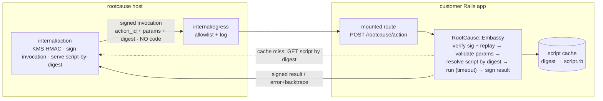

# rootcause-embassy — rootcause's in-app presence in the customer's Ruby runtime

> **Renamed:** formerly `rootcause-action-runner` / `RootCause::ActionRunner` (≤ 0.2.0); now
> `rootcause-embassy` / `RootCause::Embassy` (0.3.0+). Repo is `rootcause-embassy-ruby` — the
> per-language Ruby Embassy.

A **thin Ruby gem** the customer mounts once in their Rails app — the **Embassy**, rootcause's
trusted in-app presence and the **first action runner** in rootcause's **action plane**. It receives
a signed **invocation** from the rootcause host, **resolves the action's script by digest**, runs it
**inline with a hard timeout**, returns a **signed structured result**, and **receives async-analysis
results**. No executable code ever travels in the invocation; the gem only runs a script whose
`sha256` equals the approved `script_digest`.

> **This repo is the gem only.** The host (registry, signer, confirm/execute pages, audit) lives in
> [`rootcause`](https://github.com/rootcause-org/rootcause). The authoritative design for
> the whole plane is
> [`docs/action-plane-spec.md`](https://github.com/rootcause-org/rootcause/blob/main/docs/action-plane-spec.md)
> in that repo — **read it first**; this SPEC narrows it to the runner's responsibilities and the
> wire contract the gem must honor.

**Status:** scaffold + spec (no implementation yet). This document is the build plan.

---

## 1. What the gem is (and is not)

**It is** a synchronous, single-route HTTP component that turns a signed, digest-pinned invocation
into a structured result, running **as the host Rails app** with full app privileges.

**It is not** (push back if asked):
- **Not an arbitrary-Ruby executor.** It runs only a body whose `sha256` matches the approved
  `script_digest` in the signed invocation. A mismatch is a hard refuse.
- **Not a sandbox.** It runs in-process with app privileges. Safety comes from: approved +
  digest-pinned scripts only, signature + replay on the channel, params bound as **data** (never
  interpolated into source), and dual-sided audit. Real isolation is a later runtime swap.
- **Not a registry / approver.** The gem never decides what is allowed; it verifies the signature and
  the digest, fetches an approved body from rootcause on a cache miss, and runs it.
- **Not async.** Inline, synchronous, with a hard timeout. No job queue, no callbacks of its own.
- **Not a sender.** It returns a result to rootcause; the human-reviewed email draft is rootcause's
  concern, never the gem's.

## 2. Where it sits in the plane



The gem only ever talks to **one** rootcause origin (configured `fetch_url` host). It accepts
invocations signed with the **per-project reverse-channel secret** (distinct from the email
`webhook_secret`).

## 3. Responsibilities, in order (the request path)

A single mounted handler does exactly this, fail-closed at every step:

1. **Verify** the invocation signature — `X-Webhook-Signature: sha256=<hex>` over the **raw** body,
   HMAC-SHA256 with the configured reverse-channel `secret`, **constant-time** compare.
2. **Replay-guard** — reject if `issued_at` is outside a ±5 min window, or if `nonce` has been seen
   (bounded in-memory / cache store of recent nonces).
3. **Validate trusted tenant context** — the signed top-level `tenant_id`, `tenant_slug`, and
   `tenant_scope_value` keys must be strings when present. A flat invocation omits all three; a
   tenant-bound invocation requires a non-nil UUID id + canonical
   lowercase slug. Scope value may be absent/empty; no env-bound field may contain NUL. A strict
   deployment may exempt selected signed action ids through `tenantless_actions`; partial tuples
   always refuse.
4. **Validate params** against the `schema` carried in the invocation (defense in depth — rootcause
   already validated at propose-time). Types: `string`, `integer`, `number`, `boolean`, `string[]`.
   Tenant and principal selector names are reserved and rejected in both params and schema.
5. **Resolve the script by digest:**
   - **Cache hit** — a cached `script.rb` whose `sha256 == script_digest` → use it.
   - **Cache miss** — `GET {fetch_url}?action_id=…&digest=…` (signed the same way), **verify
     `sha256(body) == script_digest`** before caching or running. Digest mismatch / non-2xx → hard
     refuse, fail closed.
6. **Bind + execute** — params as a **frozen, symbol-keyed hash**, passed **as data, never
   interpolated into source**. Install the trusted context as `RC_TENANT_ID`, `RC_TENANT_SLUG`, and
   `RC_TENANT_SCOPE_VALUE` plus optional `RC_PRINCIPAL_KIND`, `RC_PRINCIPAL_EXTERNAL_ID`, and typed
   `RC_PRINCIPAL_CLAIM_*` values only for the serialized execution, removing stale values first and
   restoring process `ENV` afterward.
   Compile the body once into a callable that receives `params`; its last expression is the
   (JSON-serializable) return value.
7. **Hard timeout** + **rescue everything** → structured `error{class, message, backtrace}`.
8. **Return signed JSON** — `{ ok, return_value | error, stdout?, duration_ms }`, signed with the
   reverse-channel secret. **Log customer-side**: `action_id`, `digest`, param **keys** (never
   values), `ok`/`err`, `duration_ms`. Never log the secret or param values.

## 4. Public API (what the customer writes)

```ruby
# Gemfile
gem "rootcause-embassy"
```

```ruby
# config/initializers/rootcause.rb
RootCause::Embassy.configure do |c|
  c.secret    = ENV.fetch("ROOTCAUSE_ACTION_SECRET")    # one reverse-channel HMAC secret
  c.mount_at  = "/rootcause/action"                     # the single route
  c.fetch_url = "https://<rootcause>/actions/script"    # script-by-digest endpoint
  c.timeout   = 20                                       # hard per-EXECUTION timeout (seconds)
  c.total_deadline = 22                                  # whole-invocation budget: fetch + execute
  c.require_tenant_context = true                        # REQUIRED on tenant-enabled projects
  c.tenantless_actions = %w[staff_flat_action]           # narrow flat exceptions by action id
  c.logger    = Rails.logger
end
```

A shared deployment instead sets `c.secrets = { "<project UUID>" => "<non-blank secret>", ... }`
and leaves `c.secret` unset. Exactly one mode is valid. Map-mode invocation and result processing reads
only the unverified `project_id` to select a candidate key, verifies the raw bytes with it, then trusts
the payload. Missing, malformed, or unknown ids return opaque unsigned `401 bad_signature`; a selected
bad HMAC returns the ordinary refusal signed by that selected key. Map-mode health uses signed raw
`project_id=<uuid>` query bytes; single-secret mode accepts the legacy empty query. Outbound analysis
calls take `project_id:` to select a map entry locally and do not duplicate it in the wire body.

Mounting (Rails): the gem exposes a Rack app / engine route at `mount_at`. The customer adds **one
line** (or the gem auto-mounts via a Railtie — decide in §8). The recommendation, documented but not
enforced in v1, is to **restrict the route to rootcause's egress IP** at the edge and run under a
**least-privileged DB role** where feasible.

## 5. Wire contract (must match the host verbatim)

The gem implements the **customer side** of Appendix A of the action-plane spec. Three messages, all
signed with the reverse-channel secret, verify-on-raw, constant-time:

**Invocation** (rootcause → gem), `POST {mount_at}` — **no script body**:

```jsonc
{
  "action_id":     "devise_send_password_reset",
  "script_digest": "sha256:…",                    // the exact approved version the gem must run
  "params":        { "email": "x@acme.com" },     // validated, typed
  "schema":        { /* manifest param schema, for gem-side re-validation */ },
  "runtime":       "ruby",
  "project_id":    "uuid",
  "tenant_id":     "uuid",                       // host-stamped; omitted on a flat run
  "tenant_slug":   "acme",                       // host-stamped; omitted on a flat run
  "tenant_scope_value": "tenant-acme",           // host-stamped; optional/empty
  "principal": { "kind": "acme_user", "external_id": "user-8f3",
                 "claims": { "user_id": "user-8f3", "backup_ids": ["backup-7"] } },
  "nonce":         "uuid",                          // replay id
  "issued_at":     "2026-06-03T10:00:00Z"          // ±5 min window
}
```

**Script fetch** (gem → rootcause, on cache miss), `GET {fetch_url}?action_id=…&digest=…` — signed:

```jsonc
{ "action_id": "…", "digest": "sha256:…", "script": "user = User.find_by(...)…", "runtime": "ruby" }
```

The gem **verifies `sha256(script) == digest`** before caching or running. Unknown/unapproved digest
→ rootcause returns 404 → the run **fails closed**.

**Result** (gem → rootcause) — signed:

```jsonc
{ "ok": true, "return_value": { "found": true, "sent_to": "x@acme.com" },
  "stdout": "", "error": null, "duration_ms": 142 }
```

Rules: sign-then-send / verify-on-raw; constant-time compare; reject on bad signature, stale
`issued_at`, seen `nonce`, or digest mismatch. Oversize output is truncated (inline JSON only — no
files / download URLs in v1).

**One deadline for the whole invocation.** The host waits ~25s, one shot, **no retry**, so the gem
bounds fetch **and** execution together under `total_deadline` (22s); `timeout` (20s) stays the
execute backstop inside it. A breach returns the same signed `Timeout::Error` failure envelope an
over-long body produces — never a bare transport timeout on the host side.

**Replay semantics differ by direction.** This invocation route rejects a seen `nonce` (409). The
**result** route ([async-analysis-spec](docs/async-analysis-spec.md)) does not: rootcause
sends a stable `nonce = run_id` across redeliveries so the Embassy dedupes, and a duplicate there is an
idempotent signed `200 {"ok":true}` ack. A stale `issued_at` is a 409 on both.

Flat projects omit all three tenant fields so their signed bytes stay backward-compatible. A bound
invocation requires `tenant_id` and `tenant_slug` together; `tenant_scope_value` may be absent/empty.
They are trusted because the host stamps them outside model-authored params and signs the exact body.
`tenant_id`, `tenant_slug`, `tenant_scope_value`, `principal_kind`, `principal_external_id`, and their
`RC_TENANT_*` / `RC_PRINCIPAL_*` spellings are reserved param names: params can select only an in-scope
target, never assert host context. An optional `principal` has non-empty `kind` and `external_id` plus an
object of named typed claims; malformed or partial context refuses. A tenant-enabled Embassy deployment
must set `require_tenant_context = true`, making an absent tuple a hard refusal before script resolution
unless the signed action id is in `tenantless_actions`; partial tuples still refuse. Flat deployments
retain the default `false`.

### 5b. Embedded-chat token (gem → browser → host)

A **fourth**, one-directional message on a **different key**: the customer's backend mints a
short-lived HS256 JWT that lets a signed-in user talk to rootcause's embedded chat. It is signed with
the project's **`webhook_secret`** (`chat_secret`), **never** the reverse-channel `secret` — separate
privilege boundaries, no fallback in either direction. The gem only **mints**; rootcause only
**verifies** (`internal/chat/jwt.go`). Header is `{"alg":"HS256","typ":"JWT"}`; anything else is
rejected host-side.

```jsonc
{
  "sub": "<external_id>",                          // opaque, stable user id
  "aud": "rootcause:chat:<chat_project>",          // exact, host-required
  "iss": "<chat_project>",
  "jti": "uuid",                                   // single-use: burned when a session opens
  "origin": "https://admin.kampadmin.be",          // scheme://host[:port], re-checked vs the Origin header
  "tenant": "heyo",                                // OMITTED when flat; required on tenant-enabled projects
  "locale": "nl",                                  // OPTIONAL panel UI language hint; unsupported ⇒ en
  "color_scheme": "light",                         // OPTIONAL forced panel scheme (light|dark); other ⇒ auto
  "iat": 1785932045, "nbf": 1785932045, "exp": 1785939245,   // ttl 7200s default, ±60s host leeway
  "principal": { "kind": "kampadmin_admin", "external_id": "<external_id>",
                 "asserted_by": "<chat_project>", "assurance": "customer_backend_jwt" }
}
```

The `tenant` must come from the **server-side authorized** tenant context: every claim is inside the
signature, so swapping tenant/user/origin/expiry invalidates the token, and nothing outside the
signature is ever trusted.

The view helper appends a loader-contract revision to `loader.js`. The host immutable-caches that
static asset, so the revision must change whenever a generated attribute starts requiring new loader
behavior; otherwise an already-open browser can pair the new tag with stale JavaScript.

### 5c. API plane (gem → host, bearer)

A **fifth** message shape, and the only one that is not HMAC-signed: `RootCause::Embassy.api` calls
rootcause's ordinary HTTP API (the surface the `rc` CLI drives) with `Authorization: Bearer …`. It is
**generic by design** — the gem ships transport + auth, never per-endpoint wrappers, so a new host
endpoint needs no gem release. Endpoint inventory is the host's contract, not this spec's.

The `api_key` is a **third privilege boundary** (never `secret`, never `chat_secret`, no fallback).
An `rcor_` refresh token is exchanged for a 1h `rcoa_` access token —
`POST {api_base_url}/oauth/token`, form-encoded `grant_type=refresh_token`, `refresh_token`,
`client_id=rcocl_cli` — cached in-process per `(base_url, key)` behind a mutex, refreshed 60s before
expiry on a monotonic clock, and burned + re-exchanged **once** on a 401. Any non-`rcor_` key is the
bearer verbatim.

Calls return a frozen `Api::Response` (`ok?`, `status`, `body`, `field_errors`, `error`,
`retryable?`) and **never raise on an HTTP outcome** — transport/auth/5xx plus 429 and 408 (rate
limit and host-side timeout are backpressure, not a contract break) are `retryable?`, every
other 4xx is permanent. Only misconfiguration/bad arguments raise. Both config attributes are
optional and validated together at boot. Credentials are **project-pinned**, so an app spanning
several rootcause projects builds an independent caller per credential with
`Embassy.api_for(api_base_url:, api_key:)`; caches never mix. See [docs/generic-api.md](docs/generic-api.md).

## 6. The action body it runs (read-only context)

The gem **never authors** actions; it only runs them. For reference, an action in rootcause's
registry is one directory `brain/actions/<action_id>/` with `manifest.yaml` (id, description, typed
param schema, risk hint) and `script.rb`. The script references `params[:x]` and returns a JSON-able
value:

```ruby
# script.rb — params is a frozen, symbol-keyed hash of VALIDATED values.
# NEVER interpolate params into source; reference them as data.
tenant_id = ENV.fetch("RC_TENANT_ID")
raise "tenant scope missing" if tenant_id.empty?
user = User.find_by(tenant_id: tenant_id, email: params[:email])
return { found: false } unless user
user.send_reset_password_instructions
{ found: true, sent_to: user.email }
```

`digest = sha256(script.rb)` is the action's pinned identity and the **authorization unit**. The gem
runs a body **iff** its hash equals the digest in the signed invocation.

## 7. Security posture / honest caveats

- Runs **as the app**, full privileges — **no real sandbox**. The boundary is: approved +
  digest-pinned scripts only, signature + replay, params-as-data, audit.
- **`Timeout.timeout` is a backstop, not a transaction boundary.** It raises asynchronously and can
  fire mid-transaction. Actions must be written **idempotent and safe to retry**, ideally wrapping
  their own `transaction`. The gem's job is to enforce the timeout and report failure cleanly, not to
  guarantee atomicity.
- **Params are data, never source.** Compile the body once; bind `params` as a frozen symbol-keyed
  hash. A param value like `"; system('rm -rf /')"` must be inert — a string, never evaluated.
- **Tenant scope is not a param.** Read trusted scope from `RC_TENANT_ID`, `RC_TENANT_SLUG`, or
  `RC_TENANT_SCOPE_VALUE`; every tenant-aware write must scope itself with the applicable field.
- **Principal context is not a param.** `RC_PRINCIPAL_KIND`, `RC_PRINCIPAL_EXTERNAL_ID`, and typed
  `RC_PRINCIPAL_CLAIM_*` values are host-signed and only exist while that action runs.
- **`ENV` is process-global.** The executor serializes action bodies while trusted `RC_TENANT_*` and
  `RC_PRINCIPAL_*` context is installed, then restores prior values even on timeout/error so concurrent
  runs cannot cross context.
- **Fail closed everywhere:** bad signature, stale/duplicate nonce, schema violation, digest mismatch,
  fetch non-2xx → refuse, return a structured error, log it.
- **Secrets never in logs / argv / responses.** Log param **keys** only.

## 8. Build plan (decide as we implement — NOT done yet)

Open scaffolding decisions to settle when we start coding:

- **Mount mechanism** — Rails Engine vs. a Rack app the customer mounts in `routes.rb` vs. a Railtie
  that auto-inserts the route. Lean: explicit mount (least magic, easiest to restrict at the edge).
- **Script execution** — `instance_exec` / compiled proc / `Module.new` + `define_method`. Must bind
  `params` as data and capture the last expression as the return value. Decide how `stdout` is
  captured (`$stdout` swap vs. `StringIO`).
- **Nonce store** — process-memory ring buffer (single worker) vs. Rails.cache / Redis (multi-worker).
  ±5 min window means TTL-bounded.
- **Script cache** — on-disk (`tmp/rootcause/actions/<digest>.rb`) vs. in-memory; keyed by digest so
  it is immutable and self-verifying.
- **HTTP client** for the fetch — `Net::HTTP` (no new dep) preferred.
- **Framework coupling** — keep the core (verify, validate, resolve, run, sign) **framework-agnostic**
  in plain Ruby; the Rails glue is a thin shell so a Sinatra/Rack host could reuse it.

## 9. Layout (planned — gem skeleton)

```
rootcause-embassy-ruby/
├── rootcause-embassy.gemspec
├── Gemfile
├── Rakefile
├── mise.toml                      # Ruby version (mise-managed)
├── .gitignore
├── AGENTS.md                      # → .claude/CLAUDE.md (symlink)
├── .claude/CLAUDE.md              # agent project instructions (real file)
├── .claude/skills                 # → ../.agents/skills (symlink)
├── .agents/skills/                # real skills dir
├── SPEC.md                        # this file
├── lib/
│   └── rootcause/
│       └── embassy/
│           ├── version.rb
│           ├── config.rb          # the configure block
│           ├── signature.rb       # HMAC sign/verify, constant-time
│           ├── replay.rb          # ±5 min window + nonce store
│           ├── schema.rb          # param-type validation
│           ├── resolver.rb        # resolve-by-digest: cache hit / fetch + verify
│           ├── executor.rb        # bind params as data, run, timeout, rescue
│           └── rack.rb            # the mounted handler (verify → … → sign result)
└── spec/                          # RSpec
```

## 10. Testing (mirrors action-plane-spec §15, "Gem (Ruby)" row)

| Area | What |
|---|---|
| **Signature** | `Sign`/`Verify` round-trip; constant-time; forged/missing signature rejected. |
| **Replay** | `issued_at` outside ±5 min rejected; repeated `nonce` rejected on the invocation route, **acked idempotently** on the result route; fresh nonce accepted. |
| **Schema** | each type (`string`/`integer`/`number`/`boolean`/`string[]`); missing required → reject; wrong type → reject. |
| **Resolve-by-digest** | cache hit uses cached body; cache miss → fetch + verify; **digest mismatch → hard refuse** (never runs). |
| **Param binding is data** | a param value `"; system('x')"` cannot execute — it is an inert string. |
| **Trusted context** | signed tenant and optional principal context reach only the action; malformed context refuses; principal-less runs clear `RC_PRINCIPAL_*`; reserved selectors refuse. |
| **Timeout** | a hanging body is killed by the hard timeout and returns a structured error; an invocation exceeding `total_deadline` returns the same signed timeout-style failure. |
| **Errors** | any raised exception → structured `error{class, message, backtrace}`; return value must be JSON-able (non-serializable → error). |
| **Logging** | logs `action_id`/`digest`/param **keys**/`ok`/`duration_ms`; never the secret or param values. |

Test with RSpec; stub the rootcause origin (signature + script-fetch) so the gem suite needs no live
host.

## 11. Out of scope (v1)

Inherited from the action-plane spec §16: no non-Ruby runners (contract is ready), no large-output /
download URLs, no dry-run, no idempotency keys beyond the nonce, no customer-side approval gate (that
is rootcause's per-run human gate today; the **customer-held allowlist** is the launch blocker for the
first non-self-owned customer), no stronger isolation than `Timeout.timeout` yet.
